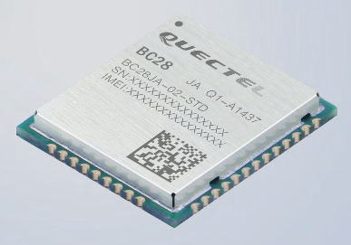

# BC28 NB-IOT Module
 Quectel BC28 NB-IoT  module driver for TiJOS

| 条目       | 说明                            |
| ---------- | ------------------------------- |
| 驱动名称   | BC28 NB-IOT 通讯模块       |
| 适用       | 该驱动适用于Quectel NB-IoT BC28 |
| 通讯方式   | UART                            |
| Java Class | TiBC28.java                     |
| 图片       |          |
|            |                                 |
